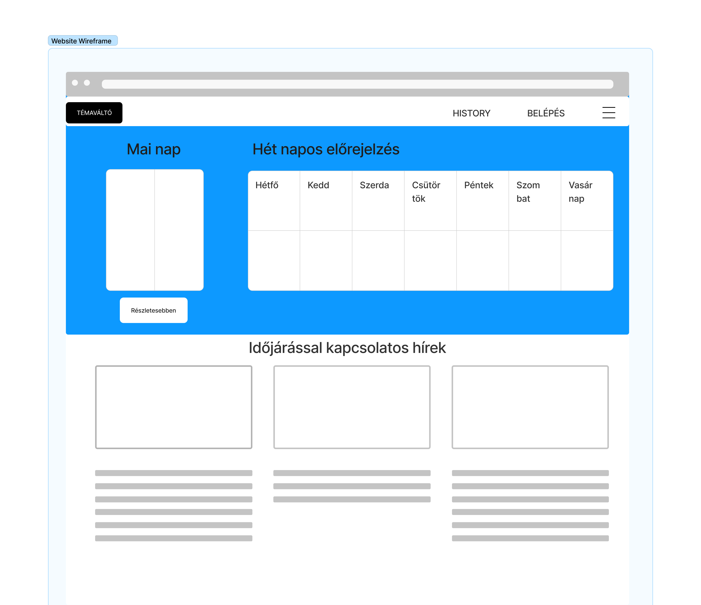
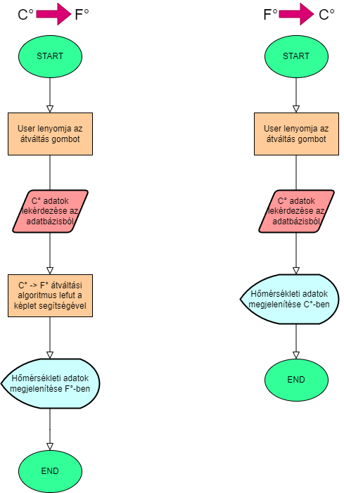

# Funkcionális Specifikáció

## Áttekintés

Az alkalmazás célja egy időjárás előrejelző létrehozása, ami széleskörben rendelkezik különböző időjárási adatokkal. Nem csak a jővőbeli időjárással kapcsolatban jelennek meg információk, hanem képes a felhasználó visszamenőleg, múltbeli nap adatait is lekérdezni. Az alkalmazás Web felülettel fog rendelkezni, Python nyelven íródik, Django segítségével. 

## A rendszer céljai és nem céljai

Az előrejelzést Prediction útján szeretnénk létrehozni, ehhez pedig TensowFlow-ot fogunk használni a tanításhoz. Projektünk egyik célja, hogy gépi tanulást segítségül hívva pontosabb előrejelzést tudjunk adni a felhasználóknak, miközben a felhasználói élményt is szem előtt tartjuk, illetve a csapatmunka során a csapat tagjai is fejlődjenek mind fejlesztés, mind kommunikáció és kivitelezés terén.

A projektünknek aktuálisan nem célja tűpontos információkat szolgálni, erőforrásunkhoz és csapatunk méretéhez mérten vagyunk képesek felelősséget vállalni a publikált információkért. A projektünk célja, hogy egy olyan alapot adjon, amelyet később bővíteni lehet, és így egyre pontosabb információkat tudunk szolgáltatni a felhasználóknak.

## Jelenlegi helyzet

Mindennapjaink meghatározó részét képezi az adott napi időjárás. Befolyásoló tényező öltözködésünkben, programjainkban, terveinkben. Nincs is rosszabb érzés, mint amikor egy sokáig tervezett esemény meghiúsul egy eső vagy egy vihar miatt. Emiatt nagyon fontos egy megbízható időjárás előrejelző alkalmazás, ami segít tájékozódni abban, hogy mi vár ránk. Létezik már több ilyen is, azonban egyik sem olyan személyre szabott, mint amit mi szeretnénk. 

## Vágyálom rendszer leírása

Az alkalmazás célja egy olyan rendszer, ami megbízható időjárás információkat közvetít. A rendszer Web felülettel rendelkezik. Az alapvető előrejelzések megtekinthetőek regisztráció nélkül is, azonban bizonyos feature-ök csak azt követően válnak elérhetővé. A felület interaktív, látványos, és színes, hogy a felhasználó figyelmét felkeltse. A rendszer képes tárolni a regisztrált/bejelentkezett felhasználók preferenciáit, így  lehetőséget nyújt a személyre szabásra. Lehetőség van az adott nap részletes adatainak megtekintésére, és a következő 7 napról is elérhetőek előrejelzések korlátozottabb részletességgel. A program nem csak a jővőbeli időjárással kapcsolatban képes információt megjeleníteni, hanem képes a felhasználó visszamenőleg, múltbeli nap adatait is lekérdezni. Ennek megfelelően rendelkezik egy keresővel, ahol a dátum beírása után megjelenik az adott napi időjárás adat.

## A rendszerre vonatkozó pályázat, törvények, rendeletek, szabványok és ajánlások felsorolása

A rendszer a Szoftverfejlesztési Módszertanok tárgy követelményeinek kell, hogy megfeleljen.
Néhány általános jogi követelmény a programmal szemben:
* Szerzői jogok: A program nem szegheti meg mások szerzői jogait, és a használt forrásoknak meg kell felelnie a szoftverlicenc feltételeinek.
* Szabályozási követelmények: A programnak meg kell felelnie azoknak a szabályozási követelményeknek, amelyek az adott iparágban vagy régióban érvényesek.
* Hátrányos kódolás: A programnak nem szabad hátrányosan megkülönböztetnie embereket faj, vallás, nemzetiség vagy egyéb személyes jellemzők alapján.

## Jelenlegi üzleti folyamatok modellje

A projekt célja egy kibővített időjárásjelentő asztali alkalmazás, amely bizonyos szintig személyreszabható, és képes a felhasználók igényeinek megfelelően működni. Erősen dependens a Python programozási nyelven, illetve a TensorFlow adatbázisain, amelyeket a projekt során használni fogunk. A projekt során a csapat tagjai a következő főfeladatokat látják el:

* TensorFlow adatbázisok tanulmányozása, adatok feldolgozása
* Python programozási nyelv tanulmányozása, a projekt során használt modulok megismerése
* Django keretrendszer tanulmányozása, a projekt során használt modulok megismerése
* Predikció megvalósítása
* Webes felület megvalósítása
* Webes felület összekötése a predikció során létrehozott adatbázissal
* Regisztrációs felület megvalósítása
* Regisztráció lehetőségének megvalósítása
* Bejelentkezés lehetőségének megvalósítása
* Személyreszabhatóság lehetőségének megvalósítása

A projekt egyéb feladatokat is tartalmazhat, amelyek a fentiekhez hasonlóak, és a projekt során merülnek fel. Bizonyos tervezett feladatok során ütközhetünk olyan problémákba, melyek befolyásolják a többi feladatot, így nem kizárt, hogy egyes felsorolt feladatok nem kerülnek megvalósításra, vagy a projekt során új feladatok merülnek fel.

Az alkalmazás 1.0 verzió tervei a következők:

| Verzió | Leírás                                  |
|-------|----------------------------------------|
| 1.0   | Alapvető funkcionalitások megvalósítása   |
| 1.0   | Alapvető webes felület megvalósítása     |
| 1.0   | Alapvető predikció megvalósítása         |
| 1.0   | Alapvető regisztrációs felület megvalósítása |
| 1.0   | Alapvető bejelentkezés lehetőségének megvalósítása |
| 1.0   | Alapvető személyreszabhatóság lehetőségének megvalósítása |

## Igényelt üzleti folyamatok modellje

Az alkalmazás munkálatait több verzióra bontjuk, ugyanis egy olyan projektet szeretnénk végigvinni, amely a csapat kapacitásához mérten bővíthető. Ezzel a tervezési folyamat rugalmasságát is biztosítani tudjuk, és szilárd alapot ad a kivitelezéshez. A verziókban történő bontás segít a csapatnak a munka megtervezésében, és a feladatok megvalósításában.

Az 1.0 verzió az, amit mindenképpen szeretnénk megvalósítani, így külön szedjük az egyéb, felhasználói élményt javító fejlesztésektől.

Az alkalmazás 1.0 verzió tervei a következők:
| Verzió | Leírás                                  |
|-------|----------------------------------------|
| 1.0   | Alapvető funkcionalitások megvalósítása   |
| 1.0   | Alapvető webes felület megvalósítása     |
| 1.0   | Alapvető predikció megvalósítása         |
| 1.0   | Alapvető regisztrációs felület megvalósítása |
| 1.0   | Alapvető bejelentkezés lehetőségének megvalósítása |
| 1.0   | Alapvető személyreszabhatóság lehetőségének megvalósítása |

A 2.0 verzióban szeretnénk a felhasználói élményt bővíteni, olyan egyéb ötleteinket soroljuk ide, melyek megvalósítása nem befolyásolja a 1.0 verzió megvalósítását, de lehetőség szerint jelentősen bővíthetik a projektünk végeredményét.

Az alkalmazás 2.0 verzió tervei a következők:
| Verzió | Leírás                                  |
|-------|----------------------------------------|
| 2.0   | Személyreszabhatóság bővítése   |
| 2.0   | Értesítő küldése kiválasztott napokról  |
| 2.0   | Esetleges új design elemek a felületen  |

## Követelmény lista

### Bejelentkezés
Lehetőség van bejelentkezésre de nem kötelező, személyre szabási funkciók csak bejelentkezéssel érhetőek el.

### Személyes hőérzet megadása
Amennyiben a felhasználó úgy dönt a személyes hőérzetét megadhatja így az alapértelmezettől eltérő ruházat ajánlásban részesülhet.

### Város megadása
Város megadása a helyi időjárás megjelenítése érdekében.

### Új város
Város hozzáadása a mentett városokhoz

### Celsius és Fahrenheit átváltása
Felhasználói preferencia szerint állítható, hogy C° vagy F° legyen az adott hőmérséklet mértékegysége.

### Napi időjárás
Adott nap részletesebb, órákra lebontott időjárási adatai biztosítása.

### Hét napos előrejelzés
Az elkövetkező hét nap időjárási predikciójának biztosítása.

### Korábbi adatok
Több évre visszamenően megtekinthető az adott nap hőmérsékleti adatai

### Mentett városok közötti választás
Több várost meg lehet adni hogy egy kattintással lehessen váltani köztük.

## Fejlesztési Folyamat

A projekt során a csapat tagjai a következő főfeladatokat látják el:
* TensorFlow adatbázisok tanulmányozása, adatok feldolgozása
* Python programozási nyelv tanulmányozása, a projekt során használt modulok megismerése
* Django keretrendszer tanulmányozása, a projekt során használt modulok megismerése
* Predikció megvalósítása
* Webes felület megvalósítása
* Webes felület összekötése a predikció során létrehozott adatbázissal
* Regisztrációs felület megvalósítása
* Regisztráció lehetőségének megvalósítása
* Bejelentkezés lehetőségének megvalósítása
* Személyreszabhatóság lehetőségének megvalósítása

A projekt egyéb feladatokat is tartalmazhat, amelyek a fentiekhez hasonlóak, és a projekt során merülnek fel. Bizonyos tervezett feladatok során ütközhetünk olyan problémákba, melyek befolyásolják a többi feladatot, így nem kizárt, hogy egyes felsorolt feladatok nem kerülnek megvalósításra, vagy a projekt során új feladatok merülnek fel.

## Használati esetek

Regisztrált Felhasználó (User): A regisztrált felhasználók olyan személyek, akik létrehoztak egy fiókot az alkalmazásban, és hozzáférnek a személyre szabott funkcionalitásokhoz.

Vendég Felhasználó (Guest): Vendég felhasználók az alkalmazásban nincsenek regisztrálva és csak az alapvető funkcionalitásokhoz férnek hozzá.

## Megfeleltetés, hogyan fedik le a használati esetek a követelményeket 

## Képernyő tervek

## Forgatókönyv
A felhasználó megadja a várost amiben tartózkodik, ezután a program kiírja az arra a városra vonatkozó időjárást és ajánl egy öltözetet.

## Megfeleltetés, hogyan fedik le a használati esetek a követelményeket

Mind a felhasználó, mind az admin képes a követelménylistán szereplő elemekhez hozzáférni, manipulálni azokat.
Az admin fő célja ezeket tesztelés során kezelni, és a projektünk esetében fontos, hogy ugyanolyan képet kapjon
a szoftverről, mint amilyen a felhasználó elé kerül. Ennek indoka, hogy a tesztelés során kiszűrjük a lehetséges 
fejlesztői hibákat, és megbizonyosodjunk, hogy ezek élettani hatása nem negatív. A funkciók jelentős része a felhasználó 
élmény javítását és magas szinten tartását szolgálja.

### Bejelentkezés
A GUI-n lehetősége van a felhasználónak bejelentkezni a saját felhasználói fiókjába, mely adatia 
a billentyűzetről kerülnek beolvasásra. A bejelentkezés lehetővé teszi, hogy a felhasználó be tudjon állítani 
és el tudjon menteni bizonyos paramétereket amelyeknek köszönhetően személyre szabottan tudja ellátni a feladatát a szoftver.

### Személyes hőérzet megadása
Lehetőséget ad a bejelentkezett felhasználóknak arra, hogy saját igényeik alapján megadják a hőérzetüket
melyet alapul vesz a ruházat ajánlásáért felelős algoritmus, ezáltal pontosabb, bizonyos esetekben 
az alapértelmezettől független öltözködési tippekkel látja el őt.

### Város megadása
Lehetőséget ad arra, hogy adott városok időjárási adai lekérdezhetőek legyenek, ezáltal még 
pontosabb lokális szűrés hajtható végre.

### Új város
Az új város funkció lényege, hogy a felhasználó el tudja menteni azokat a városokat, amelyek 
meteorológia előrejelzéseiről gyakrabban, akár napi szinten szeretne tájékozódni, ezáltal gyorsabb 
és könnyebben hozzáférhetőek lesznek a számára szükséges adatok.

### Celsius és Fahrenheit átváltása
Egy képlet segítségével biztosítjuk a hőmérsékleti adatok egyszerű és gyors átváltását ami a felhasználói 
élményt hivatott javítani, egyszerűsíteni.

### Napi időjárás
A napi időjárás funkció elérhetővé teszi az adott napi időjárási predikció órákra lebontott megtekintését.

### Hét napos előrejelzés
A hét napos előrejelzés az elkövetkezendő hét napról kínál információt a felhasználónka, ezáltal hivatott 
megkönnyíteni az el előtervezést, programok szervezését.

### Korábbi adatok
A korábbi adatok a pontos, megtörtént időjárási előzmény elérését biztosítja a felhasználónak, 
ezáltal pontosabb képet kaphat az elkövetkezendő napokról is.

### Mentett városok közötti választás
Az "új város" funkcióval elmentett települések közötti gyors és kényelmes váltást hivatott biztosítani.

## Teszttervek
A teszttervek részleteit a rendszerterv fogja tartalmazni. Megfelelő teszttervek írása előtt még az aktuálisnál is pontosabb információkra van szükségünk a fejlesztéssel kapcsolatban.

A tesztfolyamatnak arra alkalmas tag, idő és erőforrások hiányában nem lesz része a penetrációs teszt. Jelenlegi elgondolás szerint egységtesztek a python nyelven írt funkciókra fognak készülni. A tesztjegyzőkönyvben főleg felhasználás során előforduló hibákat szeretnénk kiszűrni.

## Fogalomszótár

Python - A Python egy általános célú, nagyon magas szintű programozási nyelv. A nyelv tervezési filozófiája az olvashatóságot és a programozói munka megkönnyítését helyezi előtérbe a futási sebességgel szemben.

Django - A Django egy ingyenes és nyílt forráskódú, Python-alapú webes keretrendszer, amely a modell–sablon–nézet építészeti mintát követi.

TensorFlow - A TensorFlow egy ingyenes és nyílt forráskódú szoftverkönyvtár gépi tanuláshoz és mesterséges intelligenciához.

## Pozitív felhasználói élmény biztosítása

- Felhasználóbarát GUI:
    * A grafika felhasználói felületnek könnyen használhatónak kell lennie
    * Egyértelműség: a GUI-nak egyértelműnek kell lennie a félreértés elkerülése érdekében
    * Ergonómikus kialakítás: a felhasználói felületnek olvashatónak, könnyen átláthatónak kell lennie felhasználói eszköztől függetlenül
